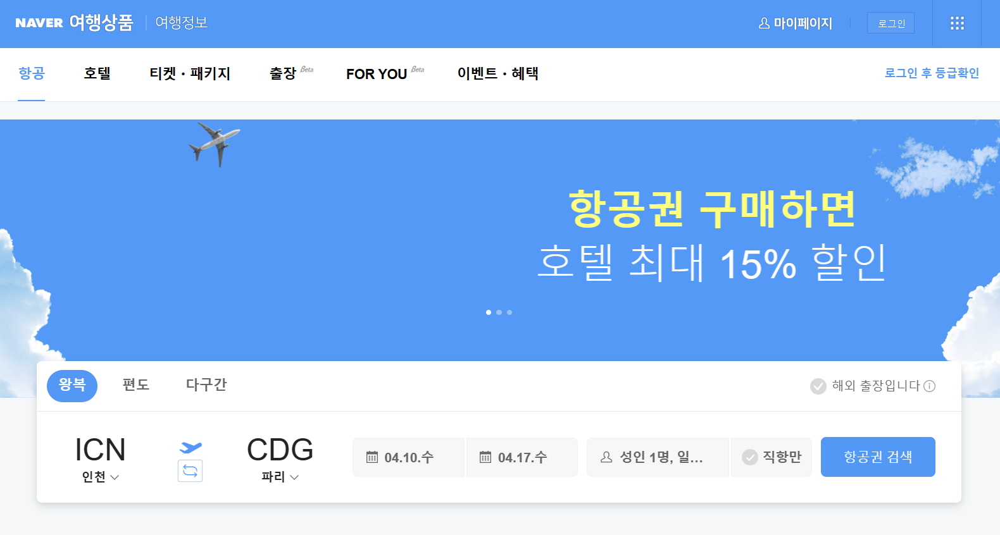

# 🛫항공권 크롤링 프로젝트

## 목차
- [개요](#개요)
- [팀 소개](#팀소개)
- [프로젝트 소개](#프로젝트소개)
- [크롤링 정보](#크롤링정보)
- [후기](#후기)

## 개요
- 프로젝트 이름: Flight Ticket
- 프로젝트 지속기간: 2024.04.01~2024.04.02
- 개발 언어: Python
- 멤버: 팀 (김가영, 김주화, 하승주)

## 팀 소개
| 분야 | 이름 | 포지션 |
| --- | --- | --- |
| 개발 | 김가영 | 🖥️ 크롤링 설계, 깃 연동, 데이터베이스 연동 |
| 개발 | 김주화 | 💻 크롤링 설계, 깃 연동, 데이터베이스 연동 |
| 개발 | 하승주 | 🖥️ 크롤링 설계, 깃 연동, 데이터베이스 연동 |

## 프로젝트 소개
  ### A. 주제
✈️**항공권 크롤링**✈️
### B. 동기 및 목적
- 코로나 팬데믹 종식 이후 해외로 여행을 떠나는 여행객이 많아지고 체감 물가지수가 높아지면서, 좀더 저렴한 항공권을 찾는 소비자들이 많아졌다.
- 소비자들이 항공권을 쉽게 비교하고 합리적인 소비를 하기 위한 항공권 정보를 제공한다. 

### C. 이용 계획
- 데이터를 활용하여 여행사들이 여행상품을 만드는 데에 참고.
- 운항 횟수가 많은 노선을 파악하여 여행지 고객선호도, 시장분석 및 트렌드를 파악

## 크롤링 정보
### A. 크롤링 대상 분석
### 네이버 항공권(https://flight.naver.com/)
-  검색 페이지

    사용자로부터 출발 도착지를 입력받고, 출발 도착 시간을 선택받아 [항공권 검색]버튼을 클릭하면 항공권 정보를 조회할 수 있다.

    

-  항공권 정보 페이지 
    
    항공권별 항공사, 출발 및 도착 시각, 소요시간, 결제 카드사, 가격 정보가 조회된다. 본 프로젝트에서는 항공권 선택에 있어 많은 영향을 

     

### B. 대상 사이트 분석
### 1. 사용한 SELECTOR  (CLASS_NAME)
1. 지역 선택
   - 출발지 자동완성 : 'autocomplete_input__1vVkF'
    - 도착지 자동완성 : 'autocomplete_inner__3Owyw'  

2. 날짜 선택
    - 월별 달력 : 'sc-kDDrLX.ctbFvd.month'
    - 연월 정보(yyyy.mm.) : 'sc-iqcoie.dCaTmH'
    - 개별 날짜 : 'sc-evZas.dDVwEk.num'
  
3. 항공권 정보 크롤링
    - 항공사명: 'airline_name__Tm2wJ'
    - 출발/도착 시간 : 'route_time__-2Z1T'
    - 소요시간 : 'route_info__1RhUH'
    - 카드사 : 'item_type__2KJOZ'
    - 가격 : 'item_num__3R0Vz'

### 2. 크롤링 주요 단계

1. 지역 선택
- 특징 : 검색어를 입력해 생성되는 자동완성 키워드를 클릭해 공항을 선택할 수 있음. 지역 이름으로 검색할 경우 둘 이상의 자동완성 키워드가 생성될 수 있음.
- 구현
   - 사용자로부터 출발지와 도착지 입력 받기
   - Selenium을 통해 값을 검색창에 전달
   - 검색 결과 자동완성으로 생성된 요소 중 첫번째 요소 클릭

2. 날짜 선택
- 특징 : 달력형태이며, 값을 키보드로 입력하지 못하고 원하는 일자의 버튼을 클릭해야 함.
- 구현 
   - 사용자로부터 출발 및 도착 연/월/일(yyyy/mm/dd)을 입력받기
   - 전체 날짜 달력 요소에서 입력값과 월별 달력 상단의 연월 정보(yyyy.mm.)가 일치하는 달력 찾기
   - 해당 월별 달력 내에서 입력받은 날짜와 일치하는 요소 클릭
 - 
3. 항공권 정보 크롤링 요소 접근
- 특징: 출발/도착 시간 총 4개가 같은 Container안에 'route_time__-2Z1T'라는 같은 ClassName을 갖고 있음. 
- 구현: text를 추출할 때 index 번호로 접근
- 코드:
        

            time = val.find_elements(By.CLASS_NAME,'route_time__-2Z1T')  
            airline = val.find_elements(By.CLASS_NAME,'airline_name__Tm2wJ')
            route_info = val.find_elements(By.CLASS_NAME,'route_info__1RhUH')
            
            if len(airline) == 1:
                tickets.append({
                    'out_항공': airline[0].text,
                    'out_출발시간' : time[0].text,
                    'out_도착시간' : time[1].text,
                    'out_소요시간' : route_info[0].text,
      
### C. 구현 방식
- SELENIUM : HTML 요소에 키보드 입력, 클릭 등의 이벤트를 주어 크롤링하기 위해 사용
- sqlalchemy : python 코드에서 DB와 연결하기 위해 사용
- Pandas : 수집한 데이터를 DataFrame에 저장하기 위해 사용
- datetime : 데이터 파일명 생성시 현재 시간 사용
- sql : 수집한 데이터를 테이블로 저장하기 위해 사용 

### D. 어려움 및 해결방안
1. 날짜 선택 관련
    
    월, 주, 요일에 따라 XPATH 경로가 달라진다는 규칙을 발견하고 이를 활용하려 하였으나,  사용자가 월, 주, 요일로 검색해야 한다는 불편과, 입력값을 바탕으로 날짜를 계산해야한다는 어려움이 있었다. 
    따라서 사용자로부터 연/월/일 입력받고, 월별 달력 상단에 있는 연월 정보(yyyy.mm.)의 요소의 텍스트를 추출해 비교한 후 해당하는 월별 달력에서 다시 날짜를 비교하여 버튼을 클릭하는 방식으로 구현하였다.  
  
2. 항공권 정보 크롤링 요소 접근
   
    항공권 정보가 table tag가 아닌 button으로 구성되어 있어, tag 위치의 규칙성을 파악하기 어려웠고 원하는 요소만 추출하는 것에 어려움이 있었다. ...

    if 문으로 왕복 항공사가 다른 것 구분

3. 브라우저 크기에 따른 화면 구성 차이

    브라우저의 크기에 따라 웹페이지 구성이 달라져 버튼이 클릭되지 않는 문제가 발생했다. 모든 환경에서도 동일하게 작동될 수 있도록 browser.maximize()를 추가하였다. 
      
## 후기
  ### 김가영🐰
  >처음에는 '크롤링만 성공하자', 성공하고 나니 'DB 연결만 해보자', 그다음에는 '좀 더 세분화되고 유익한 정보를 줄 수 있지 않을까' 하는 '도전'과 '성공', '고민'의 연속으로 저희 프로젝트는 진행되었습니다.   selenium과 webdriver를 이용하여 동적 크롤링를 진행하고 실행 결과를 확인했지만, 아쉬운 점은 '너무 느리다'는 것이었고, 이를 보완하기 위해 이후 Requests를 이용하여 정적 크롤링을 시도하고자 합니다. 또한, 사용자의 입력 결과에 따른 동적 데이터 수집이 저희 크롤링 프로젝트의 차별점이라고 생각하기 때문에 이후 검색과 검색 내역을 조회할 수 있는 GUI를 설계하고 구현하고자 합니다.   협업에 있어서는 Git Branch 전략 3가지 중 Centralized Workflow 방식으로 진행했는데 단순하지만, 충돌을 방지하며 효율적인 코드 관리가 되었다고 생각합니다. 앞으로의 프로젝트에서 깃헙의 다양한 협업 방식을 따르면서 깃헙을 통한 협업에 익숙해 지고자 합니다. 
  ### 김주화🐈
  >처음 진행해본 프로젝트라 시작을 어떻게 해야할지 감도 잡을 수가 없었다. 함께 고민하며 크롤링을 위한 코드를 짜보고 또 그 크롤링한 데이터에서 원하는 값만 추출해내는 작업이 제일 어렵고, 고민도, 시도도 많이 했던 것 같다. 원하는 데이터의 요소를 찾았지만 그 요소를 코드에 적용하는 일 또한 쉽지 않았다. 제일 어이없었던 실수는 개발자도구에서 뽑아낸 데이터가 XPATH 값을 넣어야 하는 자리에 select값을 넣는다던가 하는 일이었다. 같은 데이터이지만 여러가지의 언어로 나타낼 수 있고, 데이터를 뽑아낼 때 사용하는 언어들이 다르기 때문에 데이터를 삽입할 때 제일 유념해두어야 하는 부분인 것 같다. 사실 원하는 데이터를 추출해내는 일은 생각보다 어렵지 않은 일이지만 모르는 상태에서 진행하다보니 어떤 코드를 어떻게 적용해야할지 몰라서 많이 헤매고 찾아봤다. 그리고 그게 가장 도움되는 일이기도 했다. 내가 원하는 작업을 해내는 데에 쓸 수 있는 여러가지 코드들이 있고 그 존재를 알았다는 것만으로도 공부가 되지 않았나 싶다. 다른 조원들이 세심하게 작업해주어서 디테일한 부분도 가져갈 수 있었고 배울 수 있는 계기가 있어서 좋은 경험이었다
  ### 하승주🐈‍⬛
  >크롤링 작업에 앞서, 사용자가 선택한 출발/도착 공항과 날짜가 자동 클릭되도록 구현하는 것이 까다로웠지만 selenium의 다양한 메소드를 직접 적용해볼 수 있어 흥미로웠다. 또한 항공권 정보 페이지에서 원하는 요소만 긁어 데이터 프레임으로 만드는 것이 쉽지 않았지만 조원들과 의논하며 selector 및 코드 구조를 수정하며 문제를 해결할 수 있었다. 본 프로젝트를 통해 수업에서 배운 파이썬과 sql, 웹크롤링 내용을 복습할 수 있었고, 특히 pymysql과 sql 연동에서 부족한 부분을 확인하여 보충하고자 한다.