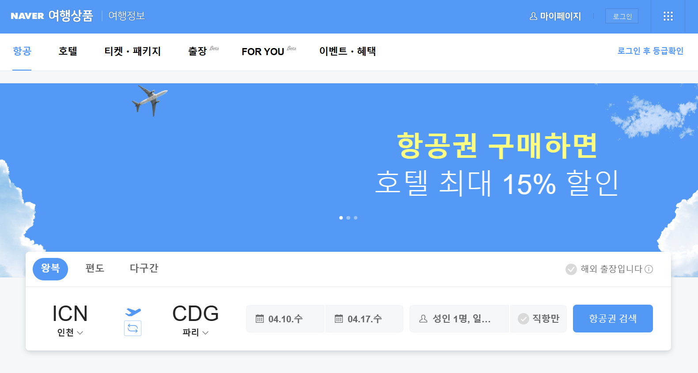

# 🛬 데이터 탐색 보고서 

## A. 크롤링 대상 분석
### 네이버 항공권(https://flight.naver.com/)
-  검색 페이지

    사용자로부터 출발 도착지를 입력받고, 출발 도착 시간을 선택받아 [항공권 검색]버튼을 클릭하면 항공권 정보를 조회할 수 있다.

    

-  항공권 정보 페이지 
    
    항공권별 항공사, 출발 및 도착 시각, 소요시간, 결제 카드사, 가격 정보가 조회된다. 본 프로젝트에서는 항공권 선택에 있어 많은 영향을 

     

## B. 대상 사이트 분석
### 1. 사용한 SELECTOR  (CLASS_NAME)
1. 지역 선택
   - 출발지 자동완성 : 'autocomplete_input__1vVkF'
    - 도착지 자동완성 : 'autocomplete_inner__3Owyw'  

2. 날짜 선택
    - 월별 달력 : 'sc-kDDrLX.ctbFvd.month'
    - 연월 정보(yyyy.mm.) : 'sc-iqcoie.dCaTmH'
    - 개별 날짜 : 'sc-evZas.dDVwEk.num'
  
3. 항공권 정보 크롤링
    - 개별 항공권 : 'concurrent_ConcurrentItemContainer__2lQVG'
    - 항공사명: 'airline_name__Tm2wJ'
    - 출발/도착 시간 : 'route_time__-2Z1T'
    - 소요시간 : 'route_info__1RhUH'
    - 카드사 : 'item_type__2KJOZ'
    - 가격 : 'item_num__3R0Vz'

### 2. 크롤링 주요 단계

1. 지역 선택
- 특징 : 검색어를 입력해 생성되는 자동완성 키워드를 클릭해 공항을 선택할 수 있음. 지역 이름으로 검색할 경우 둘 이상의 자동완성 키워드가 생성될 수 있음.
- 구현
   - 사용자로부터 출발지와 도착지 입력 받기
   - Selenium을 통해 값을 검색창에 전달
   - 검색 결과 자동완성으로 생성된 요소 중 첫번째 요소 클릭

2. 날짜 선택
- 특징 : 달력형태이며, 값을 키보드로 입력하지 못하고 원하는 일자의 버튼을 클릭해야 함.
- 구현 
   - 사용자로부터 출발 및 도착 연/월/일(yyyy/mm/dd)을 입력받기
   - 전체 날짜 달력 요소에서 입력값과 월별 달력 상단의 연월 정보(yyyy.mm.)가 일치하는 달력 찾기
   - 해당 월별 달력 내에서 입력받은 날짜와 일치하는 요소 클릭
   
3. 항공권 정보 크롤링 요소 접근
- 특징: 출발/도착 시간 총 4개가 같은 Container안에 'route_time__-2Z1T'라는 같은 ClassName을 갖고 있음. 
- 구현: text를 추출할 때 index 번호로 접근
- 코드:
        

            time = val.find_elements(By.CLASS_NAME,'route_time__-2Z1T')  
            airline = val.find_elements(By.CLASS_NAME,'airline_name__Tm2wJ')
            route_info = val.find_elements(By.CLASS_NAME,'route_info__1RhUH')
            
            if len(airline) == 1:
                tickets.append({
                    'out_항공': airline[0].text,
                    'out_출발시간' : time[0].text,
                    'out_도착시간' : time[1].text,
                    'out_소요시간' : route_info[0].text,
      
## C. 구현 방식
- SELENIUM : HTML 요소에 키보드 입력, 클릭 등의 이벤트를 주어 크롤링하기 위해 사용
- sqlalchemy : python 코드에서 DB와 연결하기 위해 사용
- Pandas : 수집한 데이터를 DataFrame에 저장하기 위해 사용
- datetime : 데이터 파일명 생성시 현재 시간 사용
- sql : 수집한 데이터를 테이블로 저장하기 위해 사용 

## D. 어려움 및 해결방안
1. 날짜 선택 관련
    
    월, 주, 요일에 따라 XPATH 경로가 달라진다는 규칙을 발견하고 이를 활용하려 하였으나,  사용자가 월, 주, 요일로 검색해야 한다는 불편과, 입력값을 바탕으로 날짜를 계산해야한다는 어려움이 있었다. 
    따라서 사용자로부터 연/월/일 입력받고, 월별 달력 상단에 있는 연월 정보(yyyy.mm.)의 요소의 텍스트를 추출해 비교한 후 해당하는 월별 달력에서 다시 날짜를 비교하여 버튼을 클릭하는 방식으로 구현하였다.  
  
2. 왕복 항공편 항공사 정보 관련
   
   항공권 정보가 table tag가 아닌 button으로 구성되어 있어, tag 위치의 규칙성을 파악해 원하는 요소만 추출하는 것에 어려움이 있었다. 크롤링 대상 사이트의 html 구조를 분석하여 개별항공권 영역의 selector를 찾고, for 문을 통해 개별 항공권 안에서 필요한 정보를 추출했다.

   본 프로젝트에서는 왕복 항공권을 기준으로 조회하여, 가는 편과 오는 편의 항공사가 같은 경우와 항공사가 다른 경우가 구분된다. 왕복 항공사가 같아 항공사 정보가 1개인 경우 정보가 추출되지 않는 문제가 발생하여, if문과 len함수를 활용해 항공사 태그의 길이가 1인 경우에는 가는 편의 항공사를 오는 편 항공사에도 입력하고, 아닌 경우에는 가는 편과 오는 편 각각의 항공사 정보를 추출했다.  

4. 브라우저 크기에 따른 화면 구성 차이

    브라우저의 크기에 따라 웹페이지 구성이 달라져 버튼이 클릭되지 않는 문제가 발생했다. 모든 환경에서도 동일하게 작동될 수 있도록 browser.maximize()를 추가하였다. 
